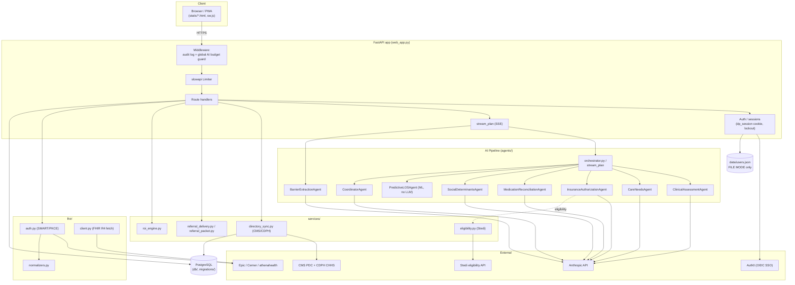

# Discharge Planning AI — Part 1: Global / System Overview

This document describes the system-level architecture, the multi-agent pipeline, authentication and authorization, multi-tenancy, rate limiting, audit logging, configuration, and deployment for the **Discharge Planning AI** application (internally branded "DischargeIQ"). It is derived strictly from the source code. Every behavioral claim is cited as `file → function/route`. Items that could not be verified from source are flagged inline and collected under **Open Questions**.

> **PHI note.** Fields that can carry Protected Health Information are flagged with **(PHI)** on first appearance. All examples in this documentation are synthetic.

> **Runtime modes.** Two modes recur throughout this documentation:
> - **FILE MODE** — no `DATABASE_URL` / `POSTGRES_URL` set. Accounts live in a local JSON file. Patient persistence, the post-acute directory, TCM, eligibility caching, milestones/barriers, ROI, and referrals are unavailable (return empty results or are skipped).
> - **DB MODE** — PostgreSQL connection string present. Multi-tenancy, patient records, directory, TCM, eligibility caching, and the rest of the persistence features are active.

## Table of Contents

1.1 [Product Overview](#11-product-overview)
1.2 [Architecture](#12-architecture)
1.3 [The Multi-Agent Pipeline](#13-the-multi-agent-pipeline)
1.4 [Runtime Modes](#14-runtime-modes)
1.5 [Authentication & Sessions](#15-authentication--sessions)
1.6 [Roles & Authorization](#16-roles--authorization)
1.7 [Multi-Tenancy](#17-multi-tenancy)
1.8 [Rate Limiting & AI Budget](#18-rate-limiting--ai-budget)
1.9 [HIPAA Audit Logging](#19-hipaa-audit-logging)
1.10 [Configuration Reference](#110-configuration-reference)
1.11 [Deployment](#111-deployment)
1.12 [Glossary](#112-glossary)
[Open Questions](#open-questions)

---

## 1.1 Product Overview

Discharge Planning AI is a California-calibrated clinical decision-support web application for hospital discharge planners, case managers, and social workers. Its central feature is an AI multi-agent pipeline that synthesizes a complete, Markdown-formatted **discharge plan** from structured patient data, streamed to the browser over Server-Sent Events (`web_app.py → stream_plan`, `web_app.py → create_plan` at route `POST /api/plan/stream`).

The coordinator system prompt positions all output as advisory decision support, never clinical orders, and tags the final document **DRAFT ONLY** requiring licensed-clinician review (`agents/coordinator.py → CoordinatorAgent.SYSTEM_PROMPT`).

Around the core pipeline the app provides:

- **Predictive LOS / discharge date** via a local ML model with heuristic fallback (`agents/predictive_los.py`).
- **Patient persistence** — patients, snapshots, plan runs, agent outputs, notes, status lifecycle (`db/patients.py`).
- **Post-acute directory** of California SNF/IRF/LTACH facilities synced from CMS + CDPH (`services/directory_sync.py`, `db/directory.py`).
- **Real-time insurance eligibility** (mock + Stedi) (`services/eligibility.py`).
- **Clinical-document generators** — summary, discharge summary, teach-back, CDPH compliance, HRRP flagging, ROI, multilingual, IMM (routes in `web_app.py`; IMM is a static tool page).
- **TCM (Transitional Care Management) billing automation** (`tcm_module.py`, `migrations/tcm_module.sql`).
- **SMART-on-FHIR EHR integration** for Epic, Cerner, athenahealth (`fhir/*`).
- **Org onboarding, invitations, and admin** (`web_app.py`, `migrations/001_multi_tenant_base.sql`).
- A **PWA** with offline support and a service worker (`static/sw.js`, `static/pwa.js`).

The acronym "DischargeIQ" appears in agent system prompts as the product name; the FastAPI app title is "Discharge Planning AI" (`web_app.py → FastAPI(title="Discharge Planning AI")`).

## 1.2 Architecture

The application is a single FastAPI app (`web_app.py`) served by uvicorn locally (`run_web.py`) or as a Vercel Python serverless function (`api/index.py`, `vercel.json`). Static HTML tool pages live under `static/` and are served directly. The AI pipeline lives in `agents/` and is driven by `orchestrator.py` (CLI path) or `web_app.py → stream_plan` (web path). External integrations are in `services/` (eligibility, directory sync, referrals) and `fhir/`. Persistence is PostgreSQL via `db/`.



Source anchors: `web_app.py → app = FastAPI(...)`, `web_app.py → _audit_log_middleware`, `web_app.py → global_ai_budget_guard`, `orchestrator.py → DischargeOrchestrator.run`, `web_app.py → stream_plan`.

## 1.3 The Multi-Agent Pipeline

The pipeline runs five LLM specialist agents plus one ML agent in parallel, then a coordinator synthesizes their outputs. The web path (`web_app.py → stream_plan`) streams events as each completes; the CLI path (`orchestrator.py → DischargeOrchestrator.run`) gathers them in a batch.

**Common agent base.** All LLM agents subclass `BaseAgent` (`agents/base_agent.py`), which calls `self.client.messages.create(...)` with:
- `model = "claude-sonnet-4-6"` (`BaseAgent.MODEL`)
- `max_tokens = 4000`, `temperature = 0.2` (`BaseAgent.MAX_TOKENS`, `BaseAgent.TEMPERATURE`)
- A per-agent `SYSTEM_PROMPT` and a single user message built by `format_input(...)`.

> Model note: the agents pin `claude-sonnet-4-6`, which supports `temperature`. The current most-capable model is `claude-opus-4-8`, on which `temperature` is removed (would 400). This is documentation only — no code change is implied.

The synchronous SDK call runs in a thread-pool executor so all agents can be awaited concurrently (`BaseAgent.run → loop.run_in_executor`). Each agent returns its assessment as a free-text string.

**Parallelism & failure tolerance.**
- CLI path: `orchestrator.py → DischargeOrchestrator.run` builds a task per agent and runs `asyncio.gather(*tasks, return_exceptions=True)`. Any agent that raised is replaced with a `"[AGENT ERROR: <name> failed — ...]"` string and logged to stderr; the coordinator proceeds with whatever outputs are available.
- Web path: `web_app.py → stream_plan` launches each agent into an `asyncio.Queue`, emitting `agent_start` / `agent_complete` / `agent_error` SSE events as they resolve, then runs the coordinator (`coordinator_start` / `coordinator_complete`). A failed agent emits `agent_error` and does not abort the run.

### 1.3.1 ClinicalAssessmentAgent
- **Source:** `agents/clinical_assessment.py → ClinicalAssessmentAgent`
- **Purpose:** Clinical picture & discharge readiness; 30-day readmission risk (LACE+ / HOSPITAL Score); predicted discharge date (EDD) via CMS geometric-mean LOS.
- **Inputs consumed** (`format_input`): demographics incl. `patient_name` **(PHI)**, `mrn` **(PHI)**, `age`, `sex`, `admission_date`, `primary_diagnosis`, `secondary_diagnoses`, `vitals`, `labs`, `functional_status`, `therapy_evaluations`, `clinical_notes` **(PHI)**, `hospital_course` **(PHI)**.
- **Output shape:** Markdown with fixed section headers: CLINICAL SUMMARY, FUNCTIONAL STATUS table, PENDING CLINICAL ITEMS, DISCHARGE READINESS, RECOMMENDED LEVEL OF CARE, READMISSION RISK ASSESSMENT, PREDICTED DISCHARGE DATE, CLINICAL FLAGS (free text constrained by `SYSTEM_PROMPT`).
- **Model:** `claude-sonnet-4-6` (inherited).

### 1.3.2 CareNeedsAgent
- **Source:** `agents/care_needs.py → CareNeedsAgent`
- **Purpose:** Post-discharge care needs (skilled nursing, therapy, monitoring, personal care, equipment, caregiver) and teach-back patient education.
- **Inputs:** `patient_name` **(PHI)**, `age/sex`, diagnoses, `functional_status`, `therapy_evaluations`, `home_environment`, `support_system`, `discharge_medications`, `hospital_course` **(PHI)**.
- **Output shape:** SKILLED NURSING / THERAPY / MONITORING / PERSONAL CARE / EQUIPMENT tables, CAREGIVER REQUIREMENT, PATIENT EDUCATION PLAN, LEVEL OF CARE CONFIRMATION, CARE NEEDS FLAGS.
- **Model:** `claude-sonnet-4-6`.

### 1.3.3 InsuranceAuthorizationAgent
- **Source:** `agents/insurance_authorization.py → InsuranceAuthorizationAgent`
- **Purpose:** Benefit verification, prior-auth, California / Medi-Cal awareness, CDPH/CMS compliance & denial management.
- **Inputs:** demographics, diagnoses, `admission_date`, `anticipated_discharge_date`, `insurance` (nested), `anticipated_post_discharge_needs`, `functional_status`, `hospital_course`, and the optional real-time eligibility result `_eligibility_result` injected by the eligibility pre-flight (`format_input` block "REAL-TIME ELIGIBILITY VERIFICATION").
- **Output shape:** INSURANCE PROFILE, BENEFIT SUMMARY, PRIOR AUTHORIZATIONS, SNF ELIGIBILITY, HOME HEALTH ELIGIBILITY, DENIAL RISK FLAGS, ESTIMATED PATIENT COST, COMPLIANCE FLAGS (incl. IMM), INSURANCE FLAGS.
- **Model:** `claude-sonnet-4-6`.

### 1.3.4 MedicationReconciliationAgent
- **Source:** `agents/medication_reconciliation.py → MedicationReconciliationAgent`
- **Purpose:** Admission-vs-discharge med reconciliation, high-alert medication safety, teach-back patient medication education.
- **Inputs:** demographics, diagnoses, `labs`, `admission_medications`, `inpatient_medications`, `discharge_medications`, `allergies` **(PHI)**, insurance (affordability), `financial_info`.
- **Output shape:** RECONCILIATION SUMMARY, HIGH-ALERT MEDICATIONS, DRUG INTERACTIONS, PRESCRIPTIONS TO WRITE, FILL BEFORE DISCHARGE, PATIENT MEDICATION EDUCATION, LAB MONITORING, AFFORDABILITY FLAGS, MEDICATION FLAGS.
- **Model:** `claude-sonnet-4-6`.

### 1.3.5 SocialDeterminantsAgent
- **Source:** `agents/social_determinants.py → SocialDeterminantsAgent`
- **Purpose:** SDOH assessment, AHC HRSN / PRAPARE screening, California resource matching, SB 1152 homeless protocol.
- **Inputs:** demographics, diagnoses, `functional_status`, `home_environment`, `support_system`, `transportation`, `financial_info`, `food_security`, `safety_concerns`, `language_literacy`, `social_history`.
- **Output shape:** HOUSING STATUS, SUPPORT SYSTEM, TRANSPORTATION, AHC HRSN SCREENING table, ICD-10-CM Z CODES, FINANCIAL BARRIERS, FOOD SECURITY, SAFETY FLAGS, LANGUAGE & LITERACY, COMMUNITY RESOURCES MATCHED, SOCIAL DETERMINANTS FLAGS.
- **Model:** `claude-sonnet-4-6`.

### 1.3.6 PredictiveLOSAgent
- **Source:** `agents/predictive_los.py → PredictiveLOSAgent`, `predict_los`, `extract_features`, `_heuristic_los`
- **Purpose:** ML length-of-stay & discharge-date prediction. **No LLM call** — runs synchronously.
- **Inputs:** 12 features extracted from `patient_data` (`extract_features`): age, ICD-10 chapter, comorbidity count, insurance type, has_pt/ot/st, living_alone, has_caregiver, snf_days_used, discharge_to_snf, admission_month.
- **Model:** local joblib bundle at `models/los_model.joblib` (`LOSModelBundle` with median/p10/p90 quantile models). If the file is absent, falls back to a deterministic heuristic (`_heuristic_los`); `model_source` is `"ml_model"` or `"heuristic"` accordingly.
- **Output shape:** `LOSPrediction` dataclass rendered to a plain-text block (predicted LOS, discharge dates, 80% confidence range, risk tier, model source, MAE, top contributing factors).
- **Orchestration:** included in the orchestrator's parallel agent dict (`orchestrator.py`) but, in the SSE web path, LOS prediction is run separately to populate `los_prediction` on the saved plan run (`web_app.py → create_plan` calls `predict_los`).

### 1.3.7 CoordinatorAgent
- **Source:** `agents/coordinator.py → CoordinatorAgent`
- **Purpose:** Synthesizes the five specialist outputs into one Markdown discharge plan.
- **Inputs:** a dict of the five specialist outputs keyed `clinical`, `care_needs`, `insurance`, `medications`, `social` (`run`); missing keys default to `"[No output received]"`.
- **Model:** `claude-sonnet-4-6`, **`max_tokens = 8000`** (overrides base; `CoordinatorAgent.MAX_TOKENS`), `temperature = 0.2`.
- **Output shape:** a fixed-section discharge plan (Patient Information, Clinical Summary, Readmission Risk, Post-Discharge Services, Medications, Follow-Up, Education, Social & Safety, California Compliance Checklist, Emergency Instructions, Open Items, Coordinator Flags) ending with a **DRAFT ONLY** disclaimer.

### 1.3.8 BarrierExtractionAgent
- **Source:** `agents/barrier_extraction.py → BarrierExtractionAgent.run`
- **Purpose:** Runs after the coordinator; scans the final plan + specialist outputs for discharge barriers and returns a JSON list, validated against `BARRIER_CATALOG` (`db/milestones_catalog.py`).
- **Model:** `claude-sonnet-4-6`, `max_tokens = 2000`, **`temperature = 0`** (deterministic).
- **Output shape:** list of dicts `{barrier_type, label, category, description, priority, ai_confidence, ai_evidence}`; only entries with `ai_confidence >= 0.6` are kept, deduplicated by `barrier_type`. Persistence is the caller's job (`web_app.py → create_plan` calls `_bulk_create_milestones`). Runs only in DB MODE with milestones available.

## 1.4 Runtime Modes

| Feature | FILE MODE (no DB) | DB MODE (PostgreSQL) | Source |
|---|---|---|---|
| AI plan generation (SSE) | ✅ Available | ✅ Available | `web_app.py → stream_plan` |
| Predictive LOS | ✅ (no DB needed) | ✅ | `agents/predictive_los.py` |
| Login / accounts | ✅ via `data/users.json` | ✅ via `users` table | `web_app.py → register_user / authenticate_user` |
| Patient persistence (patients, snapshots, runs, notes, status) | ❌ empty / not saved | ✅ | `web_app.py → list_patients` (`if not DATABASE_URL ... return empty`), `db/patients.py` |
| Run export | ❌ | ✅ | `web_app.py → GET /api/patients/{id}/runs/{run_id}/export` |
| Post-acute directory search/sync | ❌ | ✅ | `web_app.py → directory_*`, `db/directory.py` |
| Eligibility caching | ❌ (live/mock still callable) | ✅ cached | `db/patients.py → eligibility_cache` |
| Eligibility verification (mock/live) | ✅ (no caching) | ✅ | `services/eligibility.py` |
| Milestones / barrier extraction | ❌ | ✅ | `web_app.py → create_plan` (gated on `DATABASE_URL and _MILESTONES_AVAILABLE`) |
| ROI engine | ❌ | ✅ | `services/roi_engine.py`, `db/roi.py` |
| Referrals | ❌ | ✅ | `db/referrals.py`, `services/referral_*` |
| TCM module | ❌ (episode creation gated on `DATABASE_URL`) | ✅ | `tcm_module.py`, `web_app.py → _maybe_create_tcm_episode` |
| Multi-tenancy / RLS | ❌ (DEFAULT_ORG_ID, single org) | ✅ org isolation | `migrations/001_multi_tenant_base.sql`, `db/__init__.py` |
| SMART-on-FHIR | ✅ (stateless; cookie-stored tokens) | ✅ | `fhir/*`, `web_app.py → fhir_*` |
| Clinical-doc generators | ✅ | ✅ | `web_app.py → *_generate` routes |

The DB switch is `DATABASE_URL = os.getenv("POSTGRES_URL") or os.getenv("DATABASE_URL")` (`web_app.py`). Many features additionally require their module to import successfully (`_PATIENT_DB_AVAILABLE`, `_DIRECTORY_DB_AVAILABLE`, `_MILESTONES_AVAILABLE`, `_ROI_ENGINE_AVAILABLE`, `_REFERRALS_AVAILABLE`, `_ELIGIBILITY_AVAILABLE`).

## 1.5 Authentication & Sessions

**Password hashing.** `web_app.py → _hash_password` uses `hashlib.pbkdf2_hmac("sha256", password, salt, 260_000)` (PBKDF2-HMAC-SHA256, 260,000 iterations); verification is constant-time via `secrets.compare_digest` (`_verify_password`). Salts are 16 random bytes hex (`register_user → secrets.token_hex(16)`).

**Session cookie.** `web_app.py → _set_session`:
- Name: `dp_session` (`COOKIE_NAME`).
- Value: itsdangerous `URLSafeTimedSerializer(SECRET_KEY)` payload `{email, org_id, role}` (`make_session_cookie`).
- Flags: `httponly=True`, `samesite="lax"`, `secure=True`.
- TTL: `COOKIE_MAX_AGE = 60*60*8` (8 hours); enforced on decode via `max_age` (`get_current_org`).
- `SECRET_KEY` is **required** at startup — the app raises `RuntimeError` if unset (`web_app.py`, line ~384). No insecure fallback.

**Progressive lockout.** `web_app.py` in-memory dicts `_login_failures`, `_login_lockouts`. Thresholds `LOCKOUT_THRESHOLDS = {5: 60, 10: 300, 20: 1800, 50: 86400}` — i.e. 5 failures → 60s lock, 10 → 5 min, 20 → 30 min, 50 → 24 h. Failures are counted within a rolling 3600s window (`_record_failed_attempt`), the highest crossed threshold's duration is applied (`_apply_lockout`), and a successful login clears both maps (`_clear_failed_attempts`). ⚠ NEEDS VERIFICATION: because the maps are in-process, lockout state is per-instance and resets on restart / does not span serverless instances.

**Auth0 SSO / OIDC.** `auth0_oidc.py` + routes `GET /auth/sso/login` and `GET /auth/sso/callback` (`web_app.py`). Uses OIDC authorization-code + PKCE (S256) with scopes `openid email profile`; Auth0 brokers enterprise IdPs (Okta/Azure AD/etc.). Configured only when `AUTH0_DOMAIN`, `AUTH0_CLIENT_ID`, `AUTH0_CLIENT_SECRET` are all set (`auth0_oidc.is_configured`). Redirect URI is `AUTH0_CALLBACK_URL` or `{APP_URL}/auth/sso/callback`. State stored in `sso_auth_state` cookie (`SSO_STATE_TTL = 300`). DB-mode SSO users have nullable password fields and a `sso_provider` column (`migrations/004_sso_users.sql`).

**SMART-on-FHIR launch.** Separate session system in `fhir/auth.py`: `fhir_session` signed cookie (8h TTL, `FHIR_SESSION_TTL`), `fhir_auth_state` cookie (5-min TTL, `FHIR_STATE_TTL`), signed with `FHIR_SESSION_SECRET` or falling back to `SECRET_KEY`. Tokens are stored only in the signed cookie — PHI is never persisted (`fhir/auth.py` module docstring). See `docs/features.md` § SMART-on-FHIR.

## 1.6 Roles & Authorization

**Role model.** The session cookie carries a `role`; `OrgContext.role` defaults to `"clinician"` (`web_app.py → get_current_org`). The DB schema documents the role enum as `super_admin | org_admin | clinician | read_only` (`migrations/001_multi_tenant_base.sql`, `users.role` comment).

**Enforcement dependency.** `web_app.py → require_role(*roles)` returns a FastAPI dependency that raises `403 Forbidden` unless `ctx.role` is in the allowed set. Most authenticated routes use `Depends(get_current_org)` (any logged-in user) rather than a role gate.

**Role-gated routes** (the only routes using `require_role`):

| Route | Allowed roles | Source |
|---|---|---|
| `GET /api/admin/users` | `org_admin`, `super_admin` | `web_app.py` line ~4080 |
| `POST /api/admin/invite` | `org_admin`, `super_admin` | `web_app.py` line ~4091 |
| `GET /api/superadmin/orgs` | `super_admin` | `web_app.py` line ~4111 |

All other `Depends(get_current_org)` routes are reachable by any authenticated user regardless of role (clinician/admin/superadmin), since no further role check is applied. ⚠ NEEDS VERIFICATION: there is no observed enforcement of a `read_only` role restricting write/mutation endpoints — the enum value exists in the schema but is not checked in `require_role` call sites.

## 1.7 Multi-Tenancy

**Org model (DB MODE).** `organizations` and `users` tables with `users.organization_id` FK (`migrations/001_multi_tenant_base.sql`). Tenant tables (`users`, `invitations`, `discharge_plans`, `audit_log`, plus all TCM tables) enforce **PostgreSQL Row-Level Security**; the application sets `SET LOCAL app.current_org_id = '<uuid>'` per transaction via `db/__init__.py → org_scoped_cursor`, and RLS policies compare `organization_id = current_setting('app.current_org_id', TRUE)::uuid`. `org_scoped_cursor` validates `org_id` is a real UUID before use.

**Org-domain from email.** The patient/milestone/ROI/referral persistence layer is scoped by **email domain**, not the UUID org: `db/patients.py → get_org_domain(email)` returns the lowercased part after `@`. Patients are unique per `(mrn, admission_date, org_domain)` and indexed by `org_domain` (`db/patients.py` schema). So two isolation mechanisms coexist: UUID-based RLS for the multi-tenant base tables, and `org_domain` string scoping for the patient/clinical-data tables.

**Cross-org denial.** RLS rejects cross-tenant queries at the DB layer even if app code has a bug (`migrations/001_multi_tenant_base.sql` comment). Superadmin reads across orgs via a separate connection that bypasses RLS (same migration). In FILE MODE there is a single implicit org (`DEFAULT_ORG_ID = "00000000-0000-0000-0000-000000000001"`).

⚠ NEEDS VERIFICATION: the FHIR patient-context check (`GET /api/fhir/patient/{id}/plan` rejects a patient_id ≠ the session patient with 403) is a per-session control, not an org-scoping control.

## 1.8 Rate Limiting & AI Budget

**Library & keying.** `slowapi` `Limiter` with `strategy="moving-window"`, `headers_enabled=True` (`web_app.py → limiter`). Enabled by `RATE_LIMIT_ENABLED` (default `true`). Storage backend selected by `RATE_LIMIT_STORAGE` (`memory` default, or `upstash` → Redis via `UPSTASH_REDIS_REST_URL` / `_TOKEN`) (`_build_storage_uri`).

- Default key: signed-session email for authed users, else client IP from `X-Forwarded-For` first hop or `get_remote_address` (`_get_key`). Never trusts `X-Forwarded-For` alone for the authed case.
- Auth endpoints use an **IP-only** key (`_get_ip_key`) so a new session cookie can't reset the counter.

**Per-endpoint limits** (representative; from `@limiter.limit(...)` decorators in `web_app.py`):

| Limit | Endpoints (examples) |
|---|---|
| `3/minute` (IP) | `POST /api/auth/signup` |
| `5/minute` (IP) | `POST /api/auth/login` |
| `30/minute` (IP) | `GET /api/onboard/check-slug` |
| `10/hour` | `POST /api/plan/stream` |
| `20/hour` | `POST /api/summary/generate`, `POST /api/discharge-summary/generate`; directory debug-fetch; referral resend |
| `30/hour` | `POST /api/roi/generate`, `/api/hrrp/generate`, `/api/cdph-compliance/analyze`, `/api/teachback/generate`, `/api/multilingual/generate`, `/api/eligibility/check`, TCM episode/visit/claim, ROI dashboards |
| `60/hour` | sample-patient, predict/los, patient status/notes, eligibility/mock, county-summary, settings, TCM contacts |
| `120/hour` | `/api/me`, patient list/detail/prefill, directory search/facility/sync/sync-status, referrals list/get, milestones |
| `12/hour` | `GET /api/directory/cron-sync` |
| `3/hour` | `POST /api/pilot/apply` |
| `5/hour` (IP) | `POST /api/onboard/create-org` |

(See `docs/features.md` for the per-feature limit on each generator.)

**Global hourly AI cap.** Middleware `web_app.py → global_ai_budget_guard` enforces `GLOBAL_AI_HOURLY_CAP` (default **500**) across all users for the AI endpoints in `_AI_ENDPOINTS` (`/api/plan/stream`, `/api/summary/generate`, `/api/discharge-summary/generate`, `/api/teachback/generate`, `/api/cdph-compliance/analyze`, `/api/roi/generate`, `/api/hrrp/generate`, `/api/multilingual/generate`). Counters are bucketed by `YYYYMMDDHH`; old buckets are pruned. When exceeded it returns **HTTP 503** with `{"error": "Service temporarily at capacity", ...}` and a `Retry-After: 300` header — distinct from per-user 429s so ops can tell system saturation from individual throttling. ⚠ NEEDS VERIFICATION: the counter is an in-process dict, so the cap is per-instance, not truly global across serverless instances despite the docstring.

**429 response shape.** `web_app.py → _rate_limit_handler` returns:
```json
{
  "error": "Rate limit exceeded",
  "detail": "Too many requests. Limit: <limit>.",
  "retry_after_seconds": <n>,
  "retry_after_human": "<n minutes>",
  "support": "..."
}
```
Headers: `Retry-After`, `X-RateLimit-Limit`, `X-RateLimit-Reset` (epoch). A HIPAA-safe log line records only a SHA-256 prefix of the key, never the email itself.

## 1.9 HIPAA Audit Logging

**Middleware.** `web_app.py → _audit_log_middleware` runs on every request; it audits paths matching `_AUDITED_PREFIXES` (`/api/plan`, `/api/fhir`, `/api/summary`, `/api/discharge`, `/api/teachback`, `/api/cdph`, `/api/hrrp`, `/api/medications`, `/api/multilingual`, `/api/immunisation`, `/api/predict`). It extracts `email` + `org_id` from the session cookie (`_get_audit_context`) without raising.

**What's logged.** endpoint, HTTP method, response status, client IP, the acting user email + org, and an optional **MRN (PHI)** captured by the handler into `request.state.audit_mrn` (e.g. `create_plan` sets it from `patient_data["mrn"]`).

- **DB MODE:** persisted via `db.write_audit_log(org_id, email, path, method, status, ip, mrn)` (`db/__init__.py → write_audit_log`), written off the request thread with `asyncio.to_thread`.
- **FILE MODE:** logged to the `hipaa.audit` logger as a structured line including email, org, endpoint, mrn, status, ip.

**Audit log schema.** Two related definitions exist:
- `migrations/001_multi_tenant_base.sql → audit_log`: `id BIGSERIAL`, `organization_id UUID`, `user_id UUID`, `user_hash TEXT` (HMAC of email), `endpoint`, `method`, `status`, `ip`, `ts`. RLS-isolated per org.
- `migrations/003_audit_log_mrn_email.sql`: adds `user_email TEXT` and `mrn TEXT`, with indexes `audit_log_user_email` and `audit_log_mrn` for compliance ("all accesses by user X") and breach-notification ("who accessed patient Y") queries. The comment notes `user_email` replaces the unusable `user_hash`.
- `web_app.py → _ensure_audit_log_schema` (runtime self-repair) defines a simpler `audit_log` with `organization_id TEXT` and `ADD COLUMN IF NOT EXISTS` backfills, to fix drifted older deployments.

**PHI-safety.** Rate-limit logs hash the key (`_rate_limit_handler`). FHIR fetch logs record resource **counts** and types only, never values (`fhir/client.py → fetch_patient_bundle`). MRN is treated as PHI; the coordinator prompt reminds users not to enter full identifiers. ⚠ NEEDS VERIFICATION: `mrn` is stored in cleartext in the `audit_log.mrn` column (intended for breach lookups) — confirm this is acceptable under the deployment's HIPAA posture.

## 1.10 Configuration Reference

Derived from all `os.getenv` / `os.environ` reads across the codebase.

| Env var | Purpose | Default | Required for |
|---|---|---|---|
| `ANTHROPIC_API_KEY` | Anthropic SDK auth for all LLM agents/generators | none | All AI features (`web_app.py`, `tcm_module.py`, agents) |
| `SECRET_KEY` | Signs `dp_session` cookie + rate-limit key reads | none — **app refuses to start if unset** | All auth/session (`web_app.py`) |
| `ALLOWED_EMAILS` | Comma-separated allowlist gating signup | empty (no allowlist) | Signup gating (`web_app.py → do_signup`) |
| `DATABASE_URL` | PostgreSQL DSN (fallback) | none → FILE MODE | DB MODE features |
| `POSTGRES_URL` | PostgreSQL DSN (preferred; Vercel injects) | none | DB MODE features (`db/connection.py`, `web_app.py`) |
| `RATE_LIMIT_ENABLED` | Toggle rate limiting + AI budget guard | `true` | Rate limiting (`web_app.py`) |
| `RATE_LIMIT_STORAGE` | `memory` or `upstash` backend | `memory` | Distributed rate limiting (`web_app.py → _build_storage_uri`) |
| `UPSTASH_REDIS_REST_URL` | Redis URL when storage=`upstash` | none | Distributed rate limiting |
| `UPSTASH_REDIS_REST_TOKEN` | Redis token when storage=`upstash` | none | Distributed rate limiting |
| `GLOBAL_AI_HOURLY_CAP` | Global hourly AI-call cap → 503 | `500` | AI budget guard (`web_app.py`) |
| `ELIGIBILITY_ENABLED` | Enable eligibility pre-flight in plan stream | `false` | Real-time eligibility (`web_app.py`) |
| `ELIGIBILITY_MOCK` | Use mock eligibility results | `false` | Eligibility mock mode (`web_app.py`) |
| `STEDI_API_KEY` | Stedi 270/271 eligibility API key | empty | Live eligibility (`services/eligibility.py`, `web_app.py`) |
| `HOSPITAL_NPI` | Provider NPI for eligibility requests | empty | Live eligibility (`web_app.py`) |
| `CRON_SECRET` | Bearer secret for the directory cron-sync endpoint | none | Scheduled directory sync auth (`web_app.py → cron-sync`) |
| `DIRECTORY_ENABLE_CDPH` | Opt-in CDPH enrichment in full sync | empty (off) | Directory CDPH enrichment (`services/directory_sync.py → run_full_sync`) |
| `NEXT_PUBLIC_APP_URL` / `APP_URL` | Base URL for OAuth redirects | `https://discharge-planning.vercel.app` | FHIR/SSO redirect URIs (`web_app.py`) |
| `FHIR_REDIRECT_URI` | Override FHIR OAuth redirect | `{APP_URL}/api/fhir/callback` | FHIR (`web_app.py`) |
| `FHIR_SESSION_SECRET` | Signs FHIR session/state cookies | falls back to `SECRET_KEY` | FHIR sessions (`fhir/auth.py`) |
| `AUTH0_DOMAIN` / `AUTH0_CLIENT_ID` / `AUTH0_CLIENT_SECRET` | Auth0 OIDC SSO | none | SSO (`auth0_oidc.py`) |
| `AUTH0_CALLBACK_URL` | Override SSO redirect | `{APP_URL}/auth/sso/callback` | SSO (`web_app.py`) |
| `NEXT_PUBLIC_EPIC_CLIENT_ID` | Epic client id used by `/launch` page | empty | Epic EHR launch (`web_app.py → EPIC_CLIENT_ID`) |
| `FHIR_CLIENT_ID_EPIC` | Epic SMART client id | empty | Epic FHIR (`fhir/ehr_config.py`) |
| `FHIR_BASE_URL_EPIC` | Epic FHIR R4 base URL | Epic sandbox URL | Epic FHIR |
| `EPIC_SMART_VERSION` | `v1` (no PKCE) or `v2` | `v1` | Epic SMART version (`fhir/ehr_config.py`) |
| `FHIR_SCOPES_EPIC` | Space-separated scope override | Phase-1 scopes | Epic scope matching (`fhir/ehr_config.py → _scopes_from_env`) |
| `EPIC_AUTH_ENDPOINT` / `EPIC_TOKEN_ENDPOINT` | Override Epic OAuth endpoints | URL-derived | Epic FHIR |
| `FHIR_CLIENT_ID_CERNER` / `FHIR_BASE_URL_CERNER` / `CERNER_AUTH_ENDPOINT` / `CERNER_TOKEN_ENDPOINT` | Cerner SMART config | sandbox defaults / none | Cerner FHIR (`fhir/ehr_config.py`) |
| `FHIR_CLIENT_ID_ATHENA` / `FHIR_CLIENT_SECRET_ATHENA` / `FHIR_BASE_URL_ATHENA` / `ATHENA_AUTH_ENDPOINT` / `ATHENA_TOKEN_ENDPOINT` | athenahealth SMART config (confidential client) | sandbox defaults / none | athenahealth FHIR (`fhir/ehr_config.py`) |
| `DOCUMO_API_KEY` | Fax delivery (Documo) for referrals | none | Referral fax (`services/referral_delivery.py`) |
| `CAREPORT_API_KEY` / `CAREPORT_API_ENDPOINT` | CarePort referral delivery | none | Referral CarePort (`services/referral_delivery.py`) |

`requirements.txt` pins `scikit-learn>=1.9.0,<1.10` because the committed `models/los_model.joblib` is unpicklable across scikit-learn minor versions.

## 1.11 Deployment

**Local.** `run_web.py` runs `uvicorn.run("web_app:app", host="0.0.0.0", port=8000, reload=True)`. `.env` is loaded via `python-dotenv` (`web_app.py → load_dotenv()`).

**Vercel serverless.** `vercel.json` builds `api/index.py` with `@vercel/python`, including `web_app.py`, `orchestrator.py`, `sample_patient.py`, and the `fhir/`, `agents/`, `utils/`, `static/`, `models/` trees. All routes (`/(.*)`) map to `api/index.py`, which prepends the project root to `sys.path` and imports `app` from `web_app` (`api/index.py`). A Vercel cron runs `GET /api/directory/cron-sync` daily at `0 6 * * *`.

**Startup / migrations.** `web_app.py → startup` (`@app.on_event("startup")`) runs only when `DATABASE_URL` is set: `_ensure_table` (users + audit-log schema repair), then `run_migrations()` (patients), `_run_milestone_migrations()`, DRG seed (`scripts/seed_drg_reference`), and `run_directory_migrations()` + zip seeding. The directory **data** sync is deliberately not run at startup (serverless instances freeze after a request); it runs via the cron endpoint or on-demand `POST /api/directory/sync`. The SQL migration files in `migrations/*.sql` (multi-tenant base, user migration, audit columns, SSO, TCM) are applied out-of-band (e.g. via a migration tool); the in-code `run_migrations` functions create the patient/directory/milestone/referral/ROI tables idempotently with `CREATE TABLE IF NOT EXISTS`.

**Service worker cache versioning.** `static/sw.js` defines `VERSION = "dp-sw-v5"`, `CACHE_SHELL = "dp-shell-v5"`, `CACHE_DIR = "dp-directory-v1"`, and a per-patient cache prefix `CACHE_PATIENT = "dp-patient-"`. Bumping the `-v5` suffixes invalidates the cached app shell on the next activation. `IDB_VERSION = 1` for the offline IndexedDB store.

## 1.12 Glossary

| Acronym | Definition |
|---|---|
| **LOS** | Length of Stay — number of inpatient days. |
| **EDD** | Estimated/Expected Discharge Date. |
| **SNF** | Skilled Nursing Facility. |
| **IRF** | Inpatient Rehabilitation Facility. |
| **LTACH / LTCH** | Long-Term Acute Care Hospital. |
| **RCFE** | Residential Care Facility for the Elderly (California). |
| **HRRP** | Hospital Readmissions Reduction Program (CMS penalty program). |
| **TCM** | Transitional Care Management (Medicare post-discharge service, CPT 99495/99496). |
| **MDM** | Medical Decision Making (complexity level used to select the TCM CPT code). |
| **CDPH** | California Department of Public Health (regulator; Title 22). |
| **CHHS** | California Health & Human Services (open-data portal used for CDPH facility data). |
| **LACE / LACE+** | Readmission-risk index (Length of stay, Acuity, Comorbidity, ED visits). |
| **Medi-Cal** | California's Medicaid program. |
| **MMCP** | Medi-Cal Managed Care Plan. |
| **SOC** | Share of Cost (Medi-Cal beneficiary cost obligation). |
| **IHSS** | In-Home Supportive Services (California Medi-Cal personal-care benefit). |
| **NEMT** | Non-Emergency Medical Transportation (Medi-Cal benefit). |
| **QIO** | Quality Improvement Organization (handles Medicare discharge appeals; the app references Commence Health / Livanta). |
| **CMS** | Centers for Medicare & Medicaid Services. |
| **IMM** | Important Message from Medicare (required inpatient notice; initial + 48-hour). |
| **CoP** | Conditions of Participation (CMS, 42 CFR §482.43). |
| **SDOH** | Social Determinants of Health. |
| **AHC HRSN** | Accountable Health Communities Health-Related Social Needs (5-domain screening). |
| **PRAPARE** | Protocol for Responding to and Assessing Patients' Assets, Risks, and Experiences. |
| **DRG** | Diagnosis-Related Group (CMS LOS/payment benchmark). |
| **CCN** | CMS Certification Number (facility identifier). |
| **NPI** | National Provider Identifier. |
| **CPT** | Current Procedural Terminology (billing code; 99495/99496 are TCM). |
| **ROI** | Return on Investment (also Release of Information in some clinical contexts; here it is the financial ROI engine). |
| **PKCE** | Proof Key for Code Exchange (OAuth public-client security). |
| **SMART on FHIR** | Substitutable Medical Apps & Reusable Technology — SMART app launch standard over FHIR. |
| **FHIR** | Fast Healthcare Interoperability Resources (HL7 R4). |
| **PHI** | Protected Health Information. |
| **RLS** | Row-Level Security (PostgreSQL). |
| **PWA** | Progressive Web App. |
| **SB 1152 / AB 1195** | California statutes on homeless-patient discharge and post-acute provider lists. |

## Open Questions

- ⚠ Lockout state (`_login_failures`, `_login_lockouts`) is in-process and per-instance; behavior across serverless instances and restarts is unverified.
- ⚠ The global AI budget counter is an in-process dict, so the "global" cap is per-instance rather than cluster-wide despite the docstring.
- ⚠ The `read_only` role exists in the schema but no `require_role`/dependency was observed enforcing it on mutation routes.
- ⚠ `audit_log.mrn` stores MRN in cleartext (for breach lookups) — confirm this matches the deployment's HIPAA data-handling posture.
- ⚠ The exact mechanism applying `migrations/*.sql` (vs. the in-code `CREATE TABLE IF NOT EXISTS` functions) is not visible in the read sources (Alembic is in `requirements.txt` but no `alembic.ini`/versions were read).
- ⚠ Whether `users.role` is ever populated with non-`clinician` values at signup (vs. only via admin/onboarding flows) was not fully traced.
