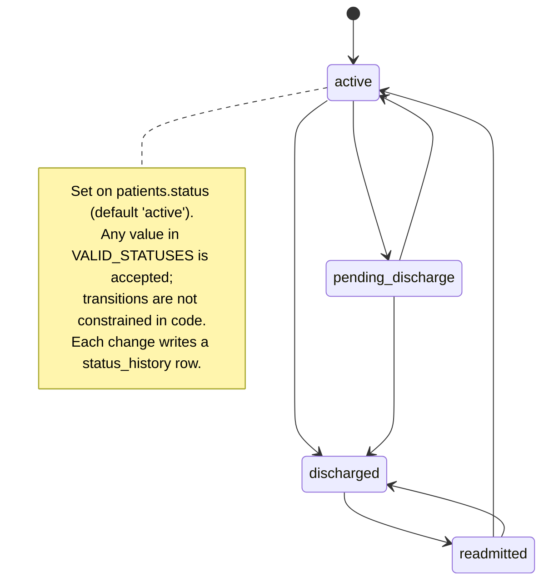
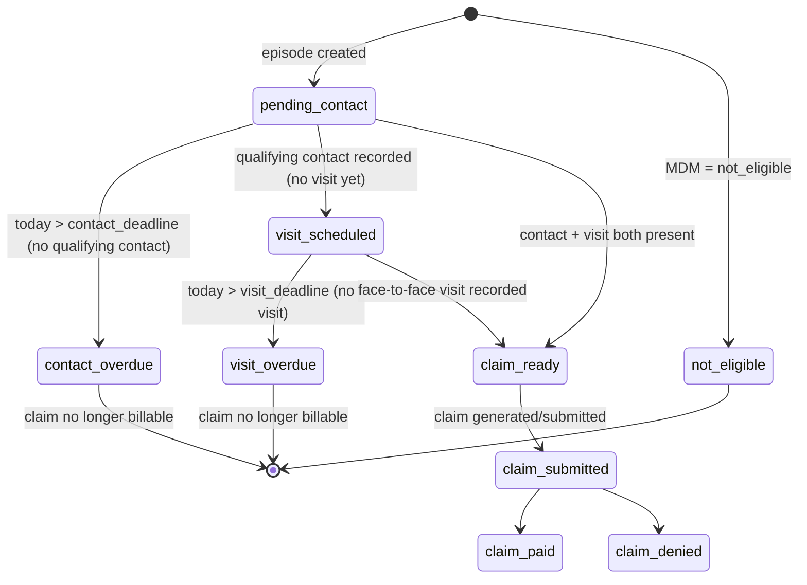
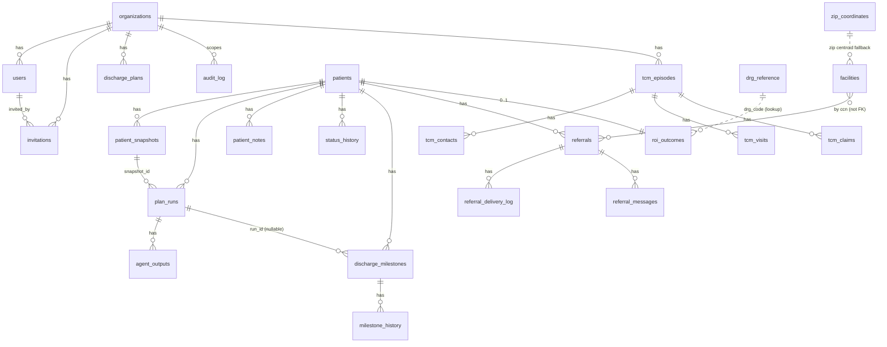

# Discharge Planning AI — Part 5: Data Model

This document catalogs every database table defined in `migrations/*.sql` and the in-code schema builders under `db/*.py`, including columns, types, relationships, and indexes. It also documents the patient status lifecycle and the TCM state machine. All tables exist **only in DB MODE** (when `DATABASE_URL` / `POSTGRES_URL` is set); in FILE MODE accounts live in `data/users.json` and no other persistence exists.

> **PHI note.** Tables and columns that can hold Protected Health Information are flagged **(PHI)**. Examples are synthetic.

## Table of Contents

- [Schema sources & ownership](#schema-sources--ownership)
- [Multi-tenant base tables](#multi-tenant-base-tables-migrations001_multi_tenant_basesql)
- [Audit log](#audit-log)
- [SSO additions](#sso-additions-migrations004_sso_userssql)
- [Patient persistence tables](#patient-persistence-tables-dbpatientspy)
- [Milestones / barriers](#milestones--barriers-dbmilestonespy)
- [Referrals](#referrals-dbreferralspy)
- [Directory](#directory-dbdirectorypy)
- [TCM tables](#tcm-tables-migrationstcm_modulesql)
- [Patient status lifecycle](#patient-status-lifecycle)
- [TCM state machine](#tcm-state-machine)
- [Entity-Relationship Diagram](#entity-relationship-diagram)
- [Open Questions](#open-questions)

## Schema sources & ownership

| Source | Tables | Applied by |
|---|---|---|
| `migrations/001_multi_tenant_base.sql` | `organizations`, `users`, `invitations`, `discharge_plans`, `audit_log` (+ RLS, `app_user` role) | SQL migration (out-of-band) |
| `migrations/002_migrate_existing_users.sql` | data migration into `organizations`/`users` | SQL migration |
| `migrations/003_audit_log_mrn_email.sql` | adds `user_email`, `mrn` to `audit_log` | SQL migration |
| `migrations/004_sso_users.sql` | nullable password fields + `sso_provider` on `users` | SQL migration |
| `migrations/tcm_module.sql` | `tcm_episodes`, `tcm_contacts`, `tcm_visits`, `tcm_claims` (+ RLS) | SQL migration |
| `db/patients.py → run_migrations` | `patients`, `patient_snapshots`, `plan_runs`, `agent_outputs`, `patient_notes`, `status_history`, `eligibility_cache`, `drg_reference`, `roi_outcomes`, `org_roi_settings`, `pilot_applications` | in-code at startup |
| `db/milestones.py → run_milestone_migrations` | `discharge_milestones`, `milestone_history` | in-code at startup |
| `db/referrals.py → run_referral_migrations` | `referrals`, `referral_delivery_log`, `referral_messages`, `org_referral_settings` | in-code at startup |
| `db/directory.py → SCHEMA_SQL` | `facilities`, `zip_coordinates`, `directory_sync_log` | in-code at startup |

> Note: there are **two `users` table definitions**. The multi-tenant migration (`001`) defines an org-scoped `users` with UUID PK, salt/hash, role, RLS. `web_app.py → _ensure_table` independently creates a *flat* `users(email PK, salt, hash, created_at)` table used by the file/DB fallback auth path. ⚠ NEEDS VERIFICATION: which `users` definition is authoritative in a given deployment, and how `_ensure_table`'s flat table coexists with migration 001's org-scoped table.

---

## Multi-tenant base tables (`migrations/001_multi_tenant_base.sql`)

### `organizations`
| Column | Type | Notes |
|---|---|---|
| `id` | UUID PK | `gen_random_uuid()` |
| `name` | TEXT NOT NULL | |
| `slug` | TEXT NOT NULL UNIQUE | URL slug |
| `domain` | TEXT | optional SSO email domain |
| `plan` | TEXT NOT NULL DEFAULT `'trial'` | `trial \| standard \| enterprise` |
| `active` | BOOLEAN NOT NULL DEFAULT TRUE | |
| `created_at` / `updated_at` | TIMESTAMPTZ | |

### `users` (org-scoped)
| Column | Type | Notes |
|---|---|---|
| `id` | UUID PK | |
| `organization_id` | UUID NOT NULL → `organizations(id)` ON DELETE CASCADE | |
| `email` | TEXT NOT NULL **(PHI-adjacent)** | |
| `salt` | TEXT | nullable after migration 004 (SSO) |
| `hash` | TEXT | nullable after migration 004 (SSO) |
| `role` | TEXT NOT NULL DEFAULT `'clinician'` | `super_admin \| org_admin \| clinician \| read_only` |
| `active` | BOOLEAN NOT NULL DEFAULT TRUE | |
| `created_at`, `last_login_at`, `deleted_at` | TIMESTAMPTZ | `deleted_at` = soft delete |
| `sso_provider` | TEXT | added by migration 004 |
- **Constraints:** `UNIQUE (organization_id, email)`.
- **Indexes:** `users_org_email (organization_id, email)`; `users_email_global (email) WHERE deleted_at IS NULL` (migration 004, for SSO cross-org login).
- **RLS:** `users_org_isolation` — `organization_id = current_setting('app.current_org_id')`.

### `invitations`
| Column | Type | Notes |
|---|---|---|
| `id` | UUID PK | |
| `organization_id` | UUID NOT NULL → `organizations(id)` CASCADE | |
| `email` | TEXT NOT NULL | invitee |
| `role` | TEXT NOT NULL DEFAULT `'clinician'` | |
| `token` | TEXT NOT NULL UNIQUE | accept token |
| `invited_by` | UUID → `users(id)` | |
| `created_at` | TIMESTAMPTZ | |
| `expires_at` | TIMESTAMPTZ DEFAULT NOW()+7 days | |
| `accepted_at` | TIMESTAMPTZ | |
- **Indexes:** `invitations_token`, `invitations_org`. **RLS:** `invitations_org_isolation`.

### `discharge_plans`
| Column | Type | Notes |
|---|---|---|
| `id` | UUID PK | |
| `organization_id` | UUID NOT NULL → `organizations(id)` CASCADE | |
| `created_by` | UUID → `users(id)` | |
| `patient_mrn` | TEXT **(PHI)** | "hashed or de-identified at app layer" per comment |
| `plan_json` | JSONB **(PHI)** | full plan |
| `created_at` / `updated_at` / `deleted_at` | TIMESTAMPTZ | soft delete |
- **Index:** `discharge_plans_org`. **RLS:** `discharge_plans_org_isolation`.
- ⚠ NEEDS VERIFICATION: the streaming plan path persists to `plan_runs` (`db/patients.py`), not `discharge_plans`; this table's write path was not observed in the read sources.

---

## Audit log

`audit_log` is defined in migration 001 and extended by migration 003; `web_app.py → _ensure_audit_log_schema` keeps a runtime variant in sync.

| Column | Type | Source | Notes |
|---|---|---|---|
| `id` | BIGSERIAL PK | 001 | |
| `organization_id` | UUID → `organizations(id)` (TEXT in the runtime variant) | 001 / web_app | |
| `user_id` | UUID → `users(id)` | 001 | |
| `user_hash` | TEXT | 001 | HMAC of email (legacy) |
| `user_email` | TEXT **(PHI-adjacent)** | 003 | added; replaces `user_hash` |
| `mrn` | TEXT **(PHI)** | 003 | patient touched |
| `endpoint`, `method` | TEXT | 001 | |
| `status` | INT | 001 | HTTP status |
| `ip` | TEXT | 001 | |
| `ts` | TIMESTAMPTZ NOT NULL DEFAULT NOW() | 001 | |
- **Indexes:** `audit_log_org_ts (organization_id, ts DESC)`; `audit_log_user_email (user_email, ts DESC)`; `audit_log_mrn (mrn, ts DESC)`.
- **RLS:** `audit_log_org_isolation` — visible when `organization_id IS NULL OR = current_org`.

---

## SSO additions (`migrations/004_sso_users.sql`)
- `users.salt` / `users.hash` → nullable (SSO users have no local password).
- adds `users.sso_provider TEXT`.
- adds index `users_email_global`.

---

## Patient persistence tables (`db/patients.py`)

`VALID_STATUSES = {"active", "pending_discharge", "discharged", "readmitted"}` (`db/patients.py`).

### `patients` **(PHI)**
| Column | Type | Notes |
|---|---|---|
| `id` | SERIAL PK | |
| `mrn` | VARCHAR(50) NOT NULL **(PHI)** | |
| `admission_date` | DATE NOT NULL | |
| `created_by` | VARCHAR(255) NOT NULL | clinician email |
| `org_domain` | VARCHAR(255) NOT NULL | email-domain tenant scope |
| `created_at` / `updated_at` | TIMESTAMPTZ | |
| `status` | VARCHAR(30) DEFAULT `'active'` | see lifecycle |
| `patient_name` | VARCHAR(255) **(PHI)** | |
| `date_of_birth` | DATE **(PHI)** | |
| `primary_diagnosis` | VARCHAR(500) **(PHI)** | |
| `actual_discharge_date`, `drg_code`, `drg_description`, `actual_los_days`, `hospital_type` (def `'nonprofit'`), `discharge_destination`, `was_readmitted` (def FALSE), `readmission_date`, `readmission_dx`, `snf_referral_status` | added via `ALTER TABLE ... ADD COLUMN IF NOT EXISTS` (patients + referrals migration) | ROI/outcome + referral fields |
- **Constraint:** `UNIQUE (mrn, admission_date, org_domain)`.
- **Indexes:** `idx_patients_org (org_domain)`, `idx_patients_mrn_org (mrn, org_domain)`.

### `patient_snapshots` **(PHI)**
| Column | Type | Notes |
|---|---|---|
| `id` | SERIAL PK | |
| `patient_id` | INTEGER NOT NULL → `patients(id)` CASCADE | |
| `snapshot_data` | JSONB NOT NULL **(PHI)** | full submitted patient form |
| `submitted_by` | VARCHAR(255) NOT NULL | |
| `submitted_at` | TIMESTAMPTZ | |

### `plan_runs`
| Column | Type | Notes |
|---|---|---|
| `id` | SERIAL PK | |
| `patient_id` | INTEGER NOT NULL → `patients(id)` CASCADE | |
| `snapshot_id` | INTEGER NOT NULL → `patient_snapshots(id)` CASCADE | |
| `run_number` | INTEGER NOT NULL | |
| `started_at` / `completed_at` | TIMESTAMPTZ | |
| `run_by` | VARCHAR(255) NOT NULL | |
| `status` | VARCHAR(20) DEFAULT `'running'` | run lifecycle: `running` → completed |
| `final_plan` | TEXT **(PHI)** | coordinator output |
| `los_prediction` | JSONB | serialized `LOSPrediction` |
- **Index:** `idx_plan_runs_patient`.

### `agent_outputs`
| Column | Type | Notes |
|---|---|---|
| `id` | SERIAL PK | |
| `run_id` | INTEGER NOT NULL → `plan_runs(id)` CASCADE | |
| `agent_name` | VARCHAR(50) NOT NULL | e.g. `clinical`, `insurance` |
| `output_text` | TEXT NOT NULL **(PHI)** | |
| `completed_at` | TIMESTAMPTZ | |
| `duration_ms` | INTEGER | |
- **Index:** `idx_agent_outputs_run`.

### `patient_notes` **(PHI)**
| Column | Type | Notes |
|---|---|---|
| `id` | SERIAL PK | |
| `patient_id` | INTEGER NOT NULL → `patients(id)` CASCADE | |
| `note_text` | TEXT NOT NULL **(PHI)** | |
| `author_email` | VARCHAR(255) NOT NULL | |
| `created_at` / `updated_at` | TIMESTAMPTZ | |
| `is_deleted` | BOOLEAN DEFAULT FALSE | soft delete |
- **Index:** `idx_notes_patient`.

### `status_history`
| Column | Type | Notes |
|---|---|---|
| `id` | SERIAL PK | |
| `patient_id` | INTEGER NOT NULL → `patients(id)` CASCADE | |
| `old_status` | VARCHAR(30) | |
| `new_status` | VARCHAR(30) NOT NULL | |
| `changed_by` | VARCHAR(255) NOT NULL | |
| `changed_at` | TIMESTAMPTZ | |
| `note` | TEXT | |

### `eligibility_cache`
| Column | Type | Notes |
|---|---|---|
| `id` | SERIAL PK | |
| `cache_key` | VARCHAR(64) NOT NULL UNIQUE | SHA-256[:32] of `member_id\|payer_id\|date` (`services/eligibility.py → _make_cache_key`) |
| `payer_id` | VARCHAR(50) NOT NULL | |
| `result_json` | JSONB NOT NULL | serialized `EligibilityResult` |
| `checked_at` | TIMESTAMPTZ | |
| `expires_at` | TIMESTAMPTZ NOT NULL | |
- **Indexes:** `idx_eligibility_cache_key`, `idx_eligibility_cache_exp`.

### `drg_reference`
| Column | Type | Notes |
|---|---|---|
| `drg_code` | VARCHAR(10) PK | |
| `drg_description` | VARCHAR(300) NOT NULL | |
| `mdc_code`, `mdc_description`, `drg_type` | VARCHAR | |
| `relative_weight` | FLOAT | |
| `geometric_mean_los` | FLOAT NOT NULL | CMS GMLOS benchmark |
| `arithmetic_mean_los` | FLOAT | |
| `fiscal_year` | INTEGER DEFAULT 2026 | |
| `is_ca_hrrp_drg` | BOOLEAN DEFAULT FALSE | |
- **Index:** `idx_drg_reference_code`. Seeded from `scripts/seed_drg_reference.py` at startup.

### `roi_outcomes`
Per-patient computed ROI record (one row per patient, `UNIQUE(patient_id)`).
| Column (selected) | Type | Notes |
|---|---|---|
| `id` | SERIAL PK | |
| `patient_id` | INTEGER NOT NULL → `patients(id)` CASCADE | |
| `org_domain`, `mrn` **(PHI)**, `admission_date`, `actual_discharge_date`, `actual_los_days` | required | |
| `drg_code`, `drg_description`, `drg_geometric_mean_los` | DRG benchmark | |
| `hospital_type` (def `'nonprofit'`), `cost_per_day` (NOT NULL) | financial inputs | |
| `excess_days_saved`, `cost_savings_dollars` | computed | |
| `discharge_destination` | VARCHAR(50) | |
| `was_readmitted`, `readmission_within_30d` | BOOLEAN | |
| `hrrp_condition_flagged`, `hrrp_penalty_avoided` | BOOLEAN | |
| `barriers_identified`, `barriers_resolved`, `avg_barrier_resolution_hours`, `had_overdue_barriers` | barrier metrics | |
| `total_plan_runs`, `first_run_at` | run metrics | |
| `predicted_los_days`, `prediction_error_days` | LOS accuracy | |
| `tcm_episode_id`, `tcm_cpt_code`, `tcm_revenue` | TCM linkage | |
| `primary_clinician` | VARCHAR(255) | |
| `calculated_at`, `calculation_version` | bookkeeping | |
- **Indexes:** `idx_roi_outcomes_org`, `_date`, `_drg`, `_patient`.

### `org_roi_settings`
| Column | Type | Notes |
|---|---|---|
| `org_domain` | VARCHAR(255) PK | |
| `hospital_type` | VARCHAR(20) DEFAULT `'nonprofit'` | |
| `cost_per_day` | FLOAT DEFAULT 4000 | |
| `hospital_name`, `license_beds`, `annual_discharges` | | |
| `fiscal_year_start` | INTEGER DEFAULT 10 | October |
| `platform_subscription_monthly` | FLOAT DEFAULT 7000 | added via ALTER |
| `created_at` / `updated_at` | TIMESTAMPTZ | |

### `pilot_applications`
Pilot-signup lead capture: `id`, `hospital_name`, `applicant_name`, `applicant_title`, `email`, `phone`, `licensed_beds`, `ehr_system`, `annual_discharges`, `how_found`, `challenge_text`, `status` (def `'pending'`), `submitted_at`, `reviewed_at`, `reviewed_by`, `notes`, `calculator_inputs` JSONB.

---

## Milestones / barriers (`db/milestones.py`)

`VALID_STATUSES = ("open", "in_progress", "blocked", "resolved", "dismissed", "cancelled")`; `VALID_PRIORITIES = ("critical", "high", "medium", "low")`.

### `discharge_milestones`
| Column | Type | Notes |
|---|---|---|
| `id` | SERIAL PK | |
| `patient_id` | INTEGER NOT NULL → `patients(id)` CASCADE | |
| `org_domain` | VARCHAR(255) NOT NULL | |
| `barrier_type` | VARCHAR(80) NOT NULL | catalog key |
| `category` | VARCHAR(40) NOT NULL | clinical/authorization/placement/social/documentation/other |
| `label` | VARCHAR(200) NOT NULL | |
| `description` | TEXT | |
| `status` | VARCHAR(30) NOT NULL DEFAULT `'open'` | |
| `assigned_to` | VARCHAR(255) | |
| `due_date`, `resolved_at`, `dismissed_at` | TIMESTAMPTZ | |
| `dismissed_reason` | TEXT | |
| `source` | VARCHAR(30) DEFAULT `'manual'` | `manual` or AI |
| `run_id` | INTEGER → `plan_runs(id)` ON DELETE SET NULL | |
| `ai_confidence` | FLOAT | |
| `ai_evidence` | TEXT | |
| `priority` | VARCHAR(10) DEFAULT `'medium'` | |
| `is_ca_specific` | BOOLEAN DEFAULT FALSE | |
| `created_by` | VARCHAR(255) NOT NULL | |
| `created_at` / `updated_at`, `notes` | | |
- **Indexes:** `idx_milestones_patient`, `_org`, `_status`, `_due`.

### `milestone_history`
`id`, `milestone_id` → `discharge_milestones(id)` CASCADE, `old_status`, `new_status` NOT NULL, `changed_by` NOT NULL, `changed_at`, `note`. Index `idx_milestone_history_mid`.

---

## Referrals (`db/referrals.py`)

### `referrals` **(PHI in packet)**
Key columns: `id` PK; `patient_id` → `patients(id)` CASCADE; `org_domain`, `created_by`; facility fields (`facility_ccn`, `facility_name`, `facility_fax`, `facility_email`, `facility_direct`); `status` (def `'draft'`); `delivery_channel`; `packet_html` TEXT **(PHI)**; `fhir_service_request` JSONB; `urgency` (def `'routine'`); `service_type`; `referral_notes`; `clinician_confirmed` BOOLEAN, `confirmed_by`, `confirmed_at`; `sent_at`, `status_updated_at`, `accepted_at`; `status_history` JSONB (def `[]`); `created_at`/`updated_at`. Indexes: `idx_referrals_org`, `_patient`, `_status`.

### `referral_delivery_log`
`id`, `referral_id` → `referrals(id)` CASCADE, `channel`, `attempted_at`, `success` BOOLEAN NOT NULL, `reference_id`, `error_message`. Index `idx_referral_delivery_referral`.

### `referral_messages`
`id`, `referral_id` → `referrals(id)` CASCADE, `org_domain`, `author_email`, `message_text` NOT NULL, `created_at`. Index `idx_referral_messages_referral`.

### `org_referral_settings`
`org_domain` PK; `default_channel` (def `'fax'`); `documo_enabled`, `careport_enabled`, `direct_enabled` BOOLEAN; `fax_cover_header`, `org_name`, `org_fax`, `org_npi`, `org_address`; `created_at`/`updated_at`.

---

## Directory (`db/directory.py`)

### `facilities`
Post-acute facility catalog (SNF/IRF/LTACH). Key columns: `id` PK; `ccn` VARCHAR(20) UNIQUE; `cdph_facid`; `name` NOT NULL; `facility_type` (def `'SNF'`); address/`city`/`county`/`state` (def `'CA'`)/`zip`/`phone`; `latitude`/`longitude` FLOAT; CMS star ratings (`overall_rating`, `health_inspection_rating`, `staffing_rating`, `quality_measures_rating`); `total_beds`, `certified_beds`, `average_daily_census`; `ownership_type`; `medicare_certified`, `medicaid_certified`, `accepts_medi_cal` BOOLEAN; `is_special_focus`, `is_special_focus_candidate`, `abuse_icon` BOOLEAN; `total_fines_dollars`, `number_of_fines`, `total_penalties`; CDPH licensed-bed counts (`licensed_snf_beds`, `licensed_icf_beds`, `licensed_alf_beds`, `licensed_total_beds`); `data_source` (def `'CMS'`); `last_synced_at`; `is_active` (def TRUE); `created_at`/`updated_at`.
- **Indexes:** `idx_facilities_zip`, `_county`, `_type`, `_rating`, `_active`, `_latlong (latitude, longitude)`.

### `zip_coordinates`
`zip` PK, `city`, `state`, `latitude` NOT NULL, `longitude` NOT NULL, `county`. (ZIP centroid fallback for facility geocoding.)

### `directory_sync_log`
`id` PK, `sync_type`, `started_at`, `completed_at`, `facilities_upserted`, `facilities_deactivated`, `status` (def `'running'`), `error_message`.

---

## TCM tables (`migrations/tcm_module.sql`)

All four TCM tables have RLS **FORCED** with policies scoped to `app.current_org_id` and granted to `app_user`.

### `tcm_episodes` **(PHI)**
| Column | Type | Notes |
|---|---|---|
| `id` | UUID PK | |
| `organization_id` | UUID NOT NULL → `organizations(id)` CASCADE | |
| `patient_mrn` **(PHI)**, `patient_name` **(PHI)** | TEXT NOT NULL | |
| `patient_dob` **(PHI)** | DATE | |
| `patient_medicare_id` **(PHI)** | TEXT | |
| `discharge_date` | DATE NOT NULL | |
| `discharge_setting` | TEXT NOT NULL | `inpatient_hospital \| snf \| irf \| ltch \| observation \| partial_hospitalization` |
| `admitting_diagnosis` (def `'Not provided'`), `discharge_diagnosis` NOT NULL | TEXT | |
| `attending_provider_npi`, `attending_provider_name` | TEXT NOT NULL | |
| `practice_tin`, `practice_npi` | TEXT | |
| `mdm_complexity` | TEXT | `moderate \| high \| not_eligible` |
| `mdm_rationale`, `mdm_rationale_json` | TEXT | AI MDM narrative + full JSON |
| `mdm_assessed_by` | TEXT DEFAULT `'ai_assisted'` | |
| `recommended_cpt` | TEXT | `99495 \| 99496 \| not_eligible` |
| `cpt_override` | TEXT | clinician override |
| `cpt_final` | TEXT **GENERATED** `COALESCE(cpt_override, recommended_cpt)` STORED | |
| `status` | TEXT NOT NULL DEFAULT `'pending_contact'` | see state machine |
| `created_by` | UUID → `users(id)` | |
| `created_at` / `updated_at` | TIMESTAMPTZ | |
- **Indexes:** `idx_tcm_episodes_org`, `_mrn (org, patient_mrn)`, `_status (org, status)`, `_discharge (discharge_date)`.

### `tcm_contacts`
`id` PK; `episode_id` → `tcm_episodes(id)` CASCADE; `organization_id`; `contact_date` DATE NOT NULL; `contact_time` TIME NOT NULL; `contact_method` (`phone \| video \| in_person`); `contact_result` (`reached \| left_voicemail \| no_answer \| patient_declined`); `contacted_by` NOT NULL; `contacted_by_id` → `users(id)`; `notes`; `is_qualifying` BOOLEAN **GENERATED** `contact_result = 'reached'` STORED; `created_at`. Index `idx_tcm_contacts_episode`.

### `tcm_visits`
`id` PK; `episode_id` → `tcm_episodes(id)` CASCADE; `organization_id`; `visit_date` DATE NOT NULL; `visit_type` (`office \| telehealth \| home`); `provider_npi`, `provider_name` NOT NULL; `visit_notes`; `time_spent_mins`; `created_at`. Index `idx_tcm_visits_episode`.

### `tcm_claims`
`id` PK; `episode_id` → `tcm_episodes(id)` CASCADE; `organization_id`; `cpt_code` NOT NULL; `icd10_primary` NOT NULL; `icd10_additional` TEXT[]; `service_date`, `date_of_discharge` DATE NOT NULL; `place_of_service` (def `'11'`); `rendering_provider_npi`, `billing_provider_npi`, `billing_provider_tin` NOT NULL; `claim_status` (def `'draft'`); `submitted_at`; `payer_id`; `claim_amount`, `paid_amount` NUMERIC(10,2); `denial_reason`; `audit_trail` JSONB NOT NULL DEFAULT `{}`; `created_at`. Index `idx_tcm_claims_episode`.

---

## Patient status lifecycle

`db/patients.py → VALID_STATUSES = {"active", "pending_discharge", "discharged", "readmitted"}`. Status changes are validated against this set (`db/patients.py → update_patient_status` and `web_app.py → PATCH /api/patients/{id}/status`, which rejects others with 400) and recorded in `status_history`. The code does not encode forbidden transitions, so any value in the set is reachable from any other.

## TCM state machine

`tcm_module.py → TCMStatus` enum and `compute_window_status` derive the episode state from contacts/visits + CMS deadlines. The 11 states: `pending_contact`, `contact_overdue`, `contact_completed`, `visit_scheduled`, `visit_overdue`, `visit_completed`, `claim_ready`, `claim_submitted`, `claim_paid`, `claim_denied`, `not_eligible`.

Deadlines (`tcm_module.py`): contact deadline = **2 business days** after discharge (`_add_business_days`, weekends excluded); visit deadline = **7 days** for CPT 99496 (high MDM) or **14 days** for 99495 (moderate MDM). `compute_window_status` recomputes the live `overall_status` and an `alert_level` (green/amber/red) on every dashboard load.

Derivation rules (`compute_window_status`): contact_overdue if no `reached` contact and past the 2-business-day deadline; visit_overdue if no visit and past the visit deadline; claim_ready (claim_eligible=True) only when both a qualifying contact and a visit exist; otherwise visit_scheduled (contact done, no visit) or pending_contact. `contact_completed` and the claim-status terminal states (`claim_submitted/paid/denied`) are enum/DB values set by the workflow rather than by `compute_window_status`.

## Entity-Relationship Diagram

> Diagram notes: the multi-tenant base tables (`organizations`/`users`/`invitations`/`discharge_plans`/`audit_log`/`tcm_*`) use UUID keys and RLS scoped by `organization_id`. The patient/clinical tables (`patients`, `plan_runs`, milestones, referrals, ROI) use SERIAL keys and are scoped by `org_domain` (email domain string), not by FK to `organizations`. `facilities`↔`referrals` is by CCN string, not a database foreign key.

## Open Questions

- ⚠ Two `users` schemas exist (org-scoped in migration 001 vs. flat `users(email PK, ...)` created by `web_app.py → _ensure_table`). Which is canonical per deployment, and whether the auth path (`authenticate_user`) reads the flat one while RLS expects the org-scoped one, was not fully reconciled.
- ⚠ `discharge_plans` write path was not observed; the streaming pipeline persists to `plan_runs`. Confirm whether `discharge_plans` is still used.
- ⚠ `roi_outcomes`/`org_roi_settings`/`drg_reference`/`pilot_applications`/patient/milestone/referral/directory tables are not under PostgreSQL RLS (only the migration-001 base tables and TCM tables are); they rely on `org_domain` filtering in queries. Confirm this is the intended isolation boundary for clinical data.
- ⚠ The TCM `audit_trail` JSONB content is populated by `tcm_module.py → generate_tcm_claim`; the persistence of `claim_status` transitions (`submitted/paid/denied`) into `tcm_claims` was not traced to specific handlers in the read sources.
